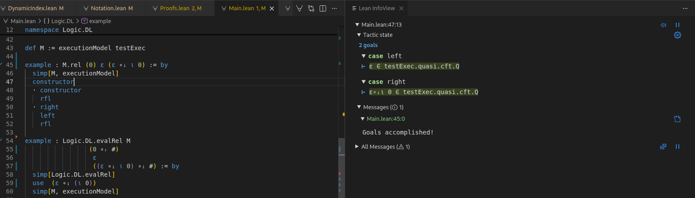

# Mechanization of Dependent Assertion Logic in Lean

This is a formalization of *Dependent Assertion Logic* (DA) in Lean, heavily based on "A Program Semantics with Dynamic State Indices", 2026, unpublished; this paper is referenced in the following and in comments as "paper". 
I sincerely recommend reading it to understand in particular the formalization approach of *REPEAT_arr* and the connection to dynamic logic.
Relevant definitions are also referenced in the code when necessary.

The project aims to mirror the paper definitions for DA as closely as possible to obtain a faithful formalization of DA in a theorem prover.
The formalization is then used to verify semantic properties of DA as well as the soundness of tableau calculus rules (planned).

## Installation

Since the goal of this project is to develop proofs, you don't run anything in the classical sense of it.
The primary way to explore the project and follow along proofs is therefore using the Lean 4 VSCodium extension and its interactive infoview, see https://lean-lang.org/install/

### Prerequisites
- Lean 4
- Git
- VSCodium/VSCode

Simply clone the repository:
```
git clone TODO: URL
cd TODO: repo name
lake update
lake build
```
This should automatically download both the required Lean version specified in lean-toolchain and the necessary Mathlib components.
The Lean infoview on the right will then show you the current proof state interactively:

## Features

- generic dynamic logic semantics
- executable semantics for finite kripke models
- formalization of the REPEAT_arr programming language
- instantiation of kripke models associated with valid REPEAT_arr executions
- proofs of semantic properties of DA (wip)
- soundness proofs of tableau calculus rules (planned)

## Project Structure
```
Logic
├── Common
├── DL
├── Extension
└── REPEAT

Main.lean
```
### Module Overview
- **Logic.Common** defines dynamic indices for execution states and atomic relations
- **Logic.DL** defines generic syntax and semantics of dynamic logic, notation and executable finite model semantics
- **Logic.Extension** defines extensions to the DA logic framework to model linear temporal logic
- **Logic.REPEAT** defines the REPEAT_arr language, axiomatic execution semantics and constructs the necessary kripke models for DA evaluation
- **Main.lean** showcases small examples


## Design Differences
Even though the formalization tries to mirror the paper very literally (which is why the layered axiomatic approach for REPEAT_arr semantics is chosen instead of inventing an operational semantics for the whole language or similar), some things are conceptually different, e.g. to accomodate for Lean notation quirks or the formal type theory.

### Notation
Examples:
| Concept | Paper  | Lean   |
|---------------|--------|--------|
| Dynamic Index | s i  | s ∘ᵢ i |
| Dynamic Index | s #  | s ∘ᵢ # |
| Dynamic Index | s 0  | s ∘ᵢ ι 0|
| Relation      | s i  | s ∘ₗ i |
| Formula       | p ≤ q ∧ q ≤ p → p = q | "p" ≤ₑ "q" ∧ₗ "q" ≤ₑ "p" →ₗ "p" =ₑ "q" |
| Formula       | ⟨0 ∪ 1*⟩ p = q | ⟨0 ∪ 1*⟩ₗ "p" =ₑ "q"|

The most notable difference here are the indices, which are part of the operators to avoid clashes with built in Lean notation.
You may read ∘ᵢ as dynamic index concatenation.
The index ₗ on logical connectives and relation concatenation is to distinguish it from Leans connectives (l standing for logic, since d or f have no unicode subscripts).
The index ₑ serves a similar purpose for conditions (e for expressions, since also c has no unicode subscript).
You can view any defined notation in the **Notation.lean** files in Logic.DL and Logic.Repeat and **Common/DynamicIndex.lean**.

### Dynamic Indices
Another notable difference is in the implementation of Dynamic Indices. The implementation distinguishes atomic dynamic indices, i.e. the alphabet Σ containing natural numbers n, $, # or the type **DynIndexSym**, from dynamic indices, i.e. words from Σ* or the type **DynIndex**.
This does allow to instantiate the Atomic Relation type for DA with the type **DynIndexSym**, and as such atomic steps in a Kripke model correspond directly to atomic dynamic indices.
It also means that the concatenation of dynamic indices ∘ᵢ and the concatenation of relations ∘ₗ are strictly distinguished other than in the paper.
See **Common/DynamicIndex.lean** for implementation details.

## Proofs
In the **Logic/DL** and **Logic/REPEAT** respectively are also **Proof.lean** files, which contain a few basic proofs already (partially) developed.

You can follow along proof states in the infoview when placing the cursor in the respective lines.

Arguably the most interesting proofs so far are `assign_changes_exactly_one_cell`, which shows that after any assignment, exactly one array cell changed; another interesting one is `model_non_branching`, which varifies that any model induced by an execution is non branching.

Further work on proofs include finishing the ones marked with `sorry` and various others - one idea for a future proof being that the axiomatic characterization of variable valuations determine a universal valuation exactly.

## Extension
In TODO: reference? DA logic was extended to model LTL. This is done by especially a notion of next, which in this implementation is obtained for free reusing the `nextState` Prop in **REPEAT/Semantics.lean**, which relates successor states. Utilizing this, the LTL operators F (eventually) and G (always) are also obtained easily. To completely model LTL, also the Until operator has to be modelled, which is currently work in progress.

### References
